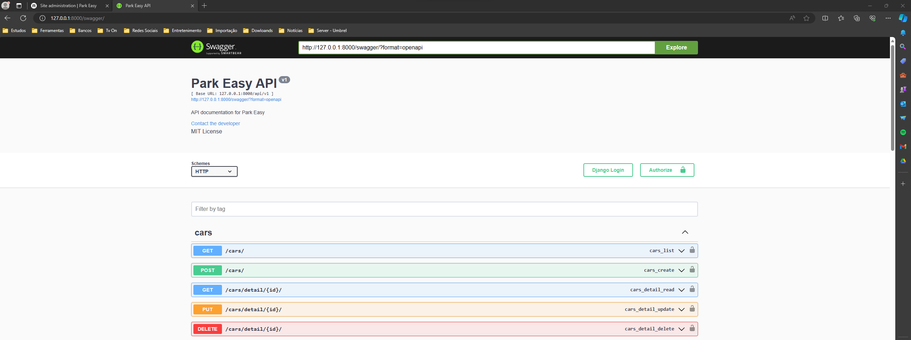
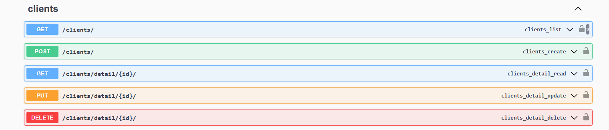
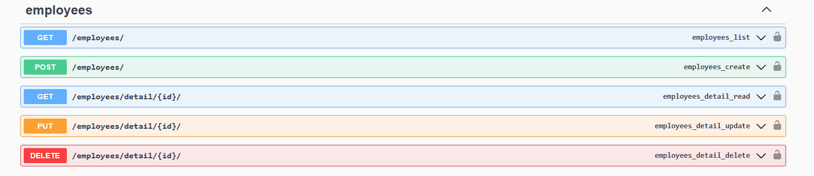
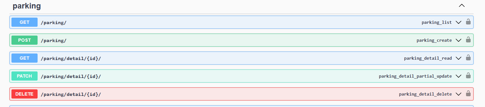
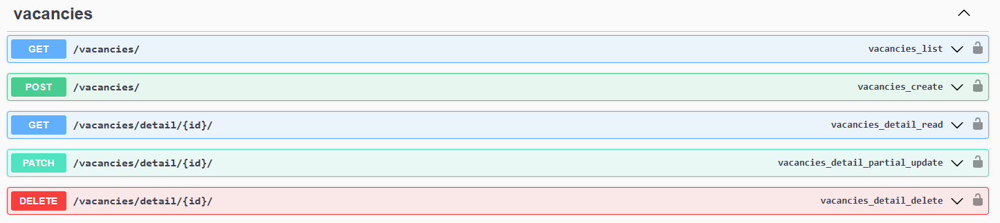

# Park Easy

Nesse repositório contém um projeto realizado o back-end com python, framework Django Rest e Docker.

Desenvolvi esse projeto com o intuito de aplicar e aprimorar minhas habilidades em Django Rest e desenvolvimento em containers utilizando o Docker.

O Projeto consiste em uma Api para gereciamento de um estacionamento. Onde o usuário do sistema (Coloborador) consegue realizar login no sistema, cadastrar-se como novo usuário e todas as operaçoes de um CRUD para carros, clientes e vagas.

### Execução do sistema

- Basta entrar no diretório do sistema e no terminal rodar o comando: docker compose -f docker-compose-dev.yaml up --build
- Isso fará com que todas as dependências sejam instaladas e um container docker seja executado.

### Exemplo da execução

#### Rota para o admin (admin/);

- Administração do sistema.

#### Carros (api/v1/cars/);

- Listar todos os carros;
- Cadastrar um carro
- Detalhes de um carro;
- Atualizar um carro;
- Deletar um carro (Deixa com o status inativo).

#### Clientes (api/v1/clients/);

- Listar todos os clientes;
- Cadastrar um clientes
- Detalhes de um clientes;
- Atualizar um clientes;
- Deletar um clientes (Deixa com o status inativo).

#### Colaborador (api/v1/employees/);

- Listar todos os colaborador;
- Cadastrar um colaborador
- Detalhes de um colaborador;
- Atualizar um colaborador;
- Deletar um colaborador (Deixa com o status inativo).
S

#### Estacionamento (api/v1/parking/);

- Essa é a rota onde é registrado a entrada do carro e o cálculo pelo tempo estacionado; 
- Listar todos os carros estacionados;
- Cadastrar um carro para uma vaga;
- Cadastrar a saída de um carro estacionado e total do tempo estacionado e valor a pagar;

#### Vagas (api/v1/vacancies/);

- Listar todas as vagas;
- Cadastrar uma vagas
- Detalhes de uma vagas;
- Atualizar uma vagas;
- Deletar uma vagas (Deixa com o status inativo).

#### Documentação - Swagger (swagger/);

